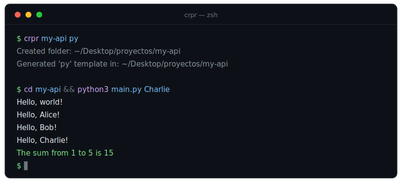
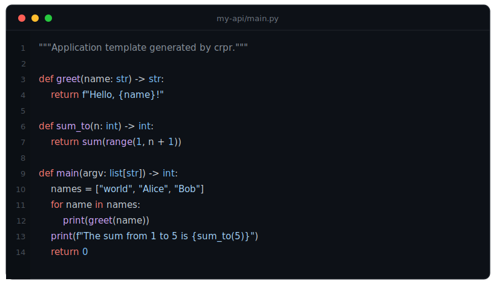

<h1 align="center">crpr</h1>

<p align="center">
  <strong>CR</strong>eate <strong>PR</strong>oyect — go from idea to a running project in a single command.
</p>

<p align="center">
  
  
  
  
  
</p>

<p align="center">
  
</p>

---

`crpr my-api py` creates the folder, drops in a **ready-to-run** starter program plus a `README.md`, and opens it in your editor. One command instead of the usual *make folder → cd → create the entry file → write boilerplate → open editor*.

The same `crpr <name> <language>` works across **47 languages**, so you never have to remember each toolchain's project layout.

## Why crpr

- **Zero friction to start.** Idea to a running file in one command. No templates to copy, no boilerplate to recall.
- **One mental model for every language.** Python, Rust, Go, C++, Haskell, Solidity — same command, predictable result.
- **Real starters, not empty files.** Each template is a small idiomatic program with a function, a loop, command-line argument handling and formatted output. It compiles or runs immediately.
- **A README in every project.** Each scaffold ships with run instructions for that exact language.
- **Customizable and portable.** Configure the projects directory and editor with environment variables. Bash, PowerShell and a `cmd.exe` launcher are included, so it drops into virtually any terminal.

## What you get

A scaffold is a working program from the first second, not a blank file:

<p align="center">
  
</p>

```text
my-api/
├── README.md     generated, with run instructions for this language
└── main.py       idiomatic starter that runs as-is
```

## Install

### macOS / Linux (Bash)

```sh
git clone https://github.com/tanodev0/crpr.git
cd crpr
./install.sh            # installs to ~/.local/bin
```

If `~/.local/bin` is not on your `PATH`, the installer prints the exact line to add to your `~/.zshrc` or `~/.bashrc`.

> System-wide install: `PREFIX=/usr/local ./install.sh` (may require `sudo`).

### Windows (PowerShell)

```powershell
git clone https://github.com/tanodev0/crpr.git
cd crpr
./install.ps1           # installs to %LOCALAPPDATA%\Programs\crpr and updates PATH
```

This makes `crpr` work in **both** PowerShell and the classic command prompt (`cmd.exe`) through the bundled `crpr.cmd` launcher. Open a new terminal afterwards.

### Manual

Copy `crpr` (Bash) or `crpr.ps1` + `crpr.cmd` (Windows) to any directory on your `PATH`.

## Usage

```sh
crpr <project-name> [language]
```

| Command | Result |
| --- | --- |
| `crpr notes` | Creates the folder only (no template) and opens it. |
| `crpr my-api py` | Folder + Python starter + `README.md`. |
| `crpr landing html` | Folder + `index.html` / `style.css` / `script.js`. |
| `crpr engine cpp` | Folder + `main.cpp` starter. |

Flags:

```sh
crpr --help       # show help
crpr --langs      # list supported language codes
crpr --version    # print version
```

If the second argument is omitted, only the folder is created. If it is not a recognized language, `crpr` warns and still creates and opens the folder.

## Configuration

Everything is configured through environment variables — no config file required.

| Variable | Default | Purpose |
| --- | --- | --- |
| `CRPR_PROJECTS_DIR` | `~/Desktop/proyectos` | Base directory where projects are created. |
| `CRPR_EDITOR` | `code` | Command used to open the project. Set to `none` to skip opening. |

```sh
# Keep projects in ~/code and open with Sublime Text
export CRPR_PROJECTS_DIR="$HOME/code"
export CRPR_EDITOR="subl"

# Scaffold without opening anything
CRPR_EDITOR=none crpr scratch py
```

On Windows (PowerShell):

```powershell
$env:CRPR_PROJECTS_DIR = "C:\code"
$env:CRPR_EDITOR = "code"
```

## Supported languages

<p align="center">
  
  
  
  
  
  
  
  
  
  
  
  
</p>

All 47 codes:

```text
py  js  ts  c   cpp java go  rs  rb  sh  html php  swift kt cs
dart scala pl  lua r   jl  hs  ex  erl clj groovy m  fs  pas
f90 nim cr  zig v   d   ml  rkt scm lisp tcl sql ps1 bat sol
elm coffee vb
```

Common aliases work too (`python`, `node`, `rust`, `golang`, `csharp`, `kotlin`, `objc`, …) and matching is case-insensitive. Languages with an idiomatic project layout also get the right config file — Rust gets `Cargo.toml` + `src/main.rs`, Go gets `go.mod`, C#/F# get a `.csproj`/`.fsproj`, Node/TS get `package.json`.

## How it works

`crpr` is a single self-contained script with no runtime dependencies beyond a POSIX shell or PowerShell. It:

1. Resolves the projects directory from `CRPR_PROJECTS_DIR`.
2. Creates `<projects-dir>/<name>` (idempotent — an existing folder is reused).
3. If a language is given, writes the template files and a `README.md`.
4. Opens the folder with `CRPR_EDITOR`.

## License

[MIT](LICENSE) © tanodev0
