<p align="center">
  
</p>

<h1 align="center">sprout</h1>

<p align="center">
  Grow a ready-to-run project in one command, in any of 47 languages.
</p>

<p align="center">
  
  
  
  
  
</p>

<p align="center">
  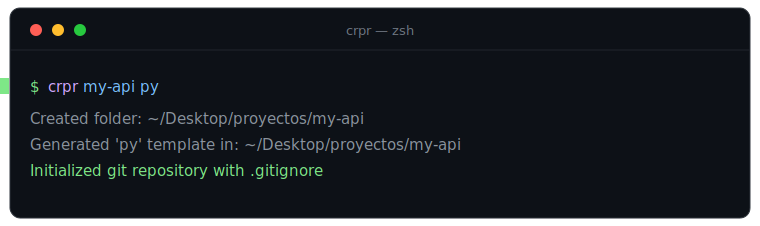
</p>

---

`sprout my-api py` creates the folder, drops in a **ready-to-run** starter program plus a `README.md`, and opens it in your editor. One command instead of the usual *make folder → cd → create the entry file → write boilerplate → open editor*.

The same `sprout <name> <language>` works across **47 languages**, so you never have to remember each toolchain's project layout.

## Why sprout

- **Zero friction to start.** Idea to a running file in one command. No templates to copy, no boilerplate to recall.
- **One mental model for every language.** Python, Rust, Go, C++, Haskell, Solidity — same command, predictable result.
- **Real starters, not empty files.** Each template is a small idiomatic program with a function, a loop, command-line argument handling and formatted output. It compiles or runs immediately.
- **Version control from the start.** Every scaffold is a git repository with a language-aware `.gitignore`, so your first commit stays clean. Opt out with `SPROUT_NO_GIT=1`.
- **A README in every project.** Each scaffold ships with run instructions for that exact language.
- **Customizable and portable.** Configure the projects directory and editor with environment variables. Bash, PowerShell and a `cmd.exe` launcher are included, so it drops into virtually any terminal.

## What you get

A scaffold is a working program from the first second, not a blank file:

<p align="center">
  
</p>

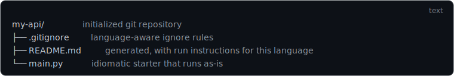

<details>
<summary>Copiar</summary>

```text
my-api/                initialized git repository
├── .gitignore         language-aware ignore rules
├── README.md          generated, with run instructions for this language
└── main.py            idiomatic starter that runs as-is
```

</details>

## Install

### Homebrew (macOS / Linux)

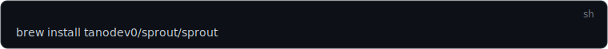

<details>
<summary>Copiar</summary>

```sh
brew install tanodev0/sprout/sprout
```

</details>

This taps `tanodev0/homebrew-sprout` and installs the `sprout` command. Upgrade later with `brew upgrade sprout`.

### macOS / Linux (Bash)

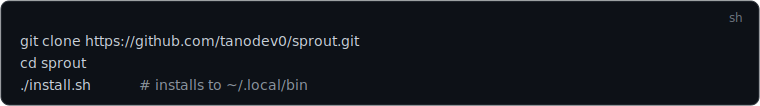

<details>
<summary>Copiar</summary>

```sh
git clone https://github.com/tanodev0/sprout.git
cd sprout
./install.sh            # installs to ~/.local/bin
```

</details>

If `~/.local/bin` is not on your `PATH`, the installer prints the exact line to add to your `~/.zshrc` or `~/.bashrc`.

> System-wide install: `PREFIX=/usr/local ./install.sh` (may require `sudo`).

### Windows (PowerShell)

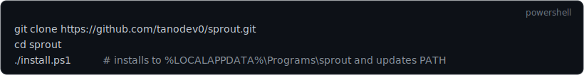

<details>
<summary>Copiar</summary>

```powershell
git clone https://github.com/tanodev0/sprout.git
cd sprout
./install.ps1           # installs to %LOCALAPPDATA%\Programs\sprout and updates PATH
```

</details>

This makes `sprout` work in **both** PowerShell and the classic command prompt (`cmd.exe`) through the bundled `sprout.cmd` launcher. Open a new terminal afterwards.

### Manual

Copy `sprout` (Bash) or `sprout.ps1` + `sprout.cmd` (Windows) to any directory on your `PATH`.

## Usage

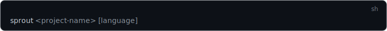 [language]">

<details>
<summary>Copiar</summary>

```sh
sprout <project-name> [language]
```

</details>

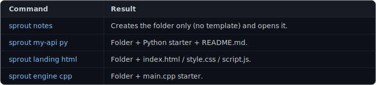

<details>
<summary>Copiar</summary>

| Command | Result |
| --- | --- |
| `sprout notes` | Creates the folder only (no template) and opens it. |
| `sprout my-api py` | Folder + Python starter + `README.md`. |
| `sprout landing html` | Folder + `index.html` / `style.css` / `script.js`. |
| `sprout engine cpp` | Folder + `main.cpp` starter. |

</details>

Flags:

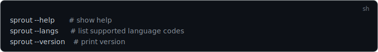

<details>
<summary>Copiar</summary>

```sh
sprout --help       # show help
sprout --langs      # list supported language codes
sprout --version    # print version
```

</details>

If the second argument is omitted, only the folder is created. If it is not a recognized language, `sprout` warns and still creates and opens the folder.

## Configuration

Everything is configured through environment variables — no config file required.

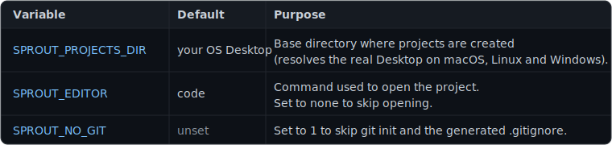

<details>
<summary>Copiar</summary>

| Variable | Default | Purpose |
| --- | --- | --- |
| `SPROUT_PROJECTS_DIR` | your OS Desktop | Base directory where projects are created (resolves the real Desktop on macOS, Linux and Windows). |
| `SPROUT_EDITOR` | `code` | Command used to open the project. Set to `none` to skip opening. |
| `SPROUT_NO_GIT` | unset | Set to `1` to skip `git init` and the generated `.gitignore`. |

</details>

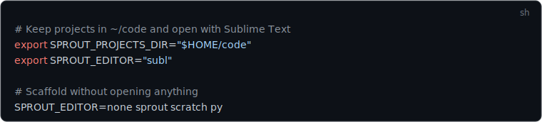

<details>
<summary>Copiar</summary>

```sh
# Keep projects in ~/code and open with Sublime Text
export SPROUT_PROJECTS_DIR="$HOME/code"
export SPROUT_EDITOR="subl"

# Scaffold without opening anything
SPROUT_EDITOR=none sprout scratch py
```

</details>

On Windows (PowerShell):

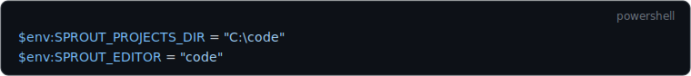

<details>
<summary>Copiar</summary>

```powershell
$env:SPROUT_PROJECTS_DIR = "C:\code"
$env:SPROUT_EDITOR = "code"
```

</details>

## Supported languages

<p align="center">
  
  
  
  
  
  
  
  
  
  
  
  
</p>

All 47 codes:

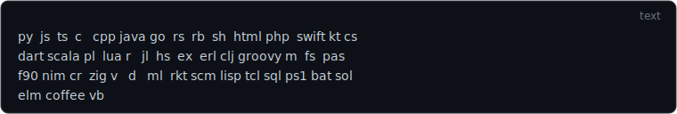

<details>
<summary>Copiar</summary>

```text
py  js  ts  c   cpp java go  rs  rb  sh  html php  swift kt cs
dart scala pl  lua r   jl  hs  ex  erl clj groovy m  fs  pas
f90 nim cr  zig v   d   ml  rkt scm lisp tcl sql ps1 bat sol
elm coffee vb
```

</details>

Common aliases work too (`python`, `node`, `rust`, `golang`, `csharp`, `kotlin`, `objc`, …) and matching is case-insensitive. Languages with an idiomatic project layout also get the right config file — Rust gets `Cargo.toml` + `src/main.rs`, Go gets `go.mod`, C#/F# get a `.csproj`/`.fsproj`, Node/TS get `package.json`.

## How it works

`sprout` is a single self-contained script with no runtime dependencies beyond a POSIX shell or PowerShell. It:

1. Resolves the projects directory from `SPROUT_PROJECTS_DIR`, defaulting to your OS Desktop.
2. Creates `<projects-dir>/<name>` (idempotent, an existing folder is reused).
3. If a language is given, writes the template files and a `README.md`.
4. Runs `git init` and writes a language-aware `.gitignore`, unless `SPROUT_NO_GIT=1` or the folder already sits inside a repository.
5. Opens the folder with `SPROUT_EDITOR`.

## License

[MIT](LICENSE) © tanodev0
